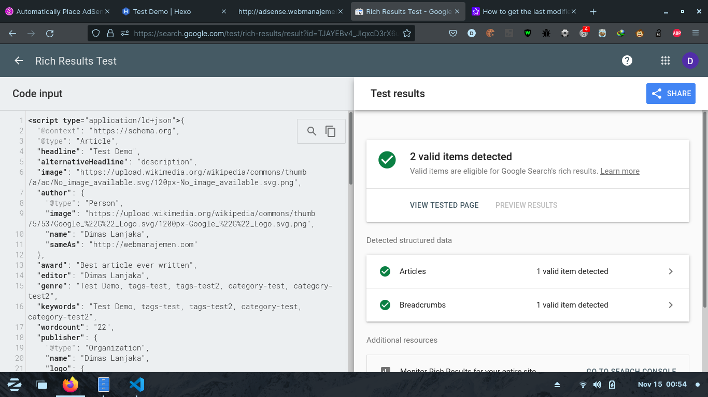

# hexo-seo
Automated Hexo Seo Optimizer (under development)

> this plugin builded with typescript and unfinished yet according issues
> - [Hexo On Exit Event](https://github.com/hexojs/hexo/issues/4822)

# Installation
Using Git Repository (Development)
```shell
npm i git+https://github.com/dimaslanjaka/hexo-seo.git
```
Using NPM Repository (Production)
```shell
npm i hexo-seo
```

# Features

- Auto add anchor title (if not exists)
- Auto determine anchor external link and nofollow them
- Auto replace broken images
- CSS JS HTML minifier
- Auto add alternate and title of images

# Usage
**Configuration**
```yaml
# https://github.com/dimaslanjaka/hexo-seo
seo:
  html:
    # fix invalid html
    fix: true
    # exclude from minify
    exclude:
      - "*.min.{htm,html}"
  # minify css
  css: # true, you can only put `true` (to minifying with default configurations) or `false` to disable css minification
    # If you want to customize the css minifier settings, you can put below
    # exclude css from minifying, multiple supported
    exclude:
      - "**/*.min.css"
  # minify js
  js: # true, you can only put `true` (to minifying with default configurations) or `false` to disable js minification
    # If you want to customize the js minifier settings, you can put below
    # exclude css from minifying, multiple supported
    exclude:
      - "**/*.min.js"
    # this is terser options, you can customize minifier with terser options https://github.com/terser/terser
    # below is config example
    options:
      compress:
        dead_code: true
      mangle:
        toplevel: true
        safari10: true
  # add rich snippets on every posts and pages
  schema: true
  img: # this function still under development because JAVASCRIPT HEAP MEMORY and my device is 8GB RAM
    # fix broken images
    broken: false
    # default broken images
    default: https://upload.wikimedia.org/wikipedia/commons/6/65/No-Image-Placeholder.svg
    # broken images methods
    # serverside : process broken images from server side (caused javascript heap out of memory, if your post large and your device has insufficient memory)
    # clientside : process broken image from client side browser with webjs
    onerror: serverside
  # external links fix
  links:
    # enable or false
    enable: true
    # allowed following links, otherwise nofollow others
    exclude:
      - webmanajemen.com
      - web-manajemen.blogspot.com
      - dimaslanjaka.github.io
```
> this plugin will run the functions based on development mode or production mode

**development mode**
```shell
set NODE_ENV=development && hexo server
# or
hexo server --development
```

# Preview




# Troubleshoot

- node_libcurl binding not found
```shell
sudo apt-get install libcurl4-openssl-dev -y
# run below codes only if above package already installed
rm -rf node_modules
npm install node-libcurl --build-from-source
```

- Fix javascript heap out of memory
```shell
# POSIX
export NODE_OPTIONS=--max_old_space_size=8096
# windows
set NODE_OPTIONS=--max_old_space_size=8096
```

- **important** after you update this plugin, you could cleaning the temp folders with:
```shell
hexo clean # this will cleaning temporarily folders of this plugin
```

# Status
[](https://github.com/dimaslanjaka/hexo-seo/issues?q=is%3Aopen+is%3Aissue+label%3A%22Status%3A+Available%22) [](https://github.com/dimaslanjaka/hexo-seo/labels/Status:%20In%20Progress) [](https://github.com/dimaslanjaka/hexo-seo/labels/Status%3A%20Review%20Needed)

[](https://github.com/dimaslanjaka/hexo-seo/labels/Priority%3A%20Critical) [](https://github.com/dimaslanjaka/hexo-seo/labels/Priority%3A%20High) [](https://github.com/dimaslanjaka/hexo-seo/labels/Priority%3A%20Medium) [](https://github.com/dimaslanjaka/hexo-seo/labels/Priority%3A%20Low)

# Website using Hexo NodeJS Blogging System

[](https://github.com/dimaslanjaka/dimaslanjaka.github.io/actions/workflows/page.yml)
[](https://github.com/dimaslanjaka/dimaslanjaka.github.io/tree/compiler)
[](https://webmanajemen.com)

## hexo-adsense
[](https://badge.fury.io/js/hexo-adsense)
[](https://npmjs.com/package/hexo-adsense)
[](https://npmjs.com/package/hexo-adsense)


## hexo-seo
[](https://badge.fury.io/js/hexo-seo)
[](https://npmjs.com/package/hexo-seo)
[](https://npmjs.com/package/hexo-seo)


## hexo-blogger-xml
[](https://badge.fury.io/js/hexo-blogger-xml)
[](https://npmjs.com/package/hexo-blogger-xml)
[](https://npmjs.com/package/hexo-blogger-xml)


<hr/>

# CHANGELOG

## [0.0.2] 2021-11-12T02:28:58
- aa6aac6 : +changelog
- a8a9759 : +changelog builder
- e08d3c2 : +cache strategy
- 3f51e9b : +eslint+prettier
- 991d43c : first initialization

## [0.0.3] 2021-11-12T22:54:50
- 1e3b064 : fix typescript compiler
- 71f5695 : +dev mode
- ef68201 : switch typescript ts-node to -dev
- 1e3f89c : fix publish compiler
- 5496ecf : fix global variable mangled by terser

## [0.0.4] 2021-11-13T11:23:28
- c3f1a9b : initialize image broker
- 3ee24bf : update css optimizer
- 8fc7dee : fix streamer
- 4045da7 : +css optimizer
- e5bdec7 : try build package declaration
- 1427c71 : fix development mode
- d581a15 : fix eslint
- 58cf87d : fix

## [0.0.5] 2021-11-13T13:42:12
- aa480af : +cache strategy
- f5874b6 : fix typestrong
- 31a0a19 : +html minifier and some improvitations
- bbbc9e8 : +cache strategy
- 5723615 : +image seo optimizer (init)
- e0c092b : +html-minifier-terser
- 5a569f7 : +cache strategy
- 58cf87d : fix

## [0.0.6] 2021-11-13T16:42:16
- dd98cdc : fix broken images
- 2ecb818 : add router as hexo middleware
- fac45e3 : +image alt and title optimized
- 58cf87d : fix

## [0.0.7] 2021-11-13T18:28:21
- bb98990 : fix external link nofollow
- 2454023 : add nofollow external link
- 02f465d : add external link filtering
- 58cf87d : fix

## [0.0.8] 2021-11-13T19:12:53
- edb6a20 : -postinstall
- 58cf87d : fix

## [0.0.9] 2021-11-13T21:13:59
- 8acb930 : update
- a879b12 : fix hexo-seo
- 58cf87d : fix

## [0.0.10] 2021-11-15T00:57:29
- a879b12 : fix hexo-seo
- 58cf87d : fix

## [1.0.11] 2021-11-15T02:27:41
- 2d50158 : fix undefined NODE_ENV [anoying]
- a879b12 : fix hexo-seo
- 58cf87d : fix

## [1.0.12] 2021-11-15T22:35:35
- bed0722 : fix missing files  Mon Nov 15 22:35:07 2021 +0700
- 7df4125 : update missconfigurable options  Mon Nov 15 22:27:48 2021 +0700
- a879b12 : fix hexo-seo  Sat Nov 13 20:47:42 2021 +0700
- 58cf87d : fix  Sat Nov 13 00:17:47 2021 +0700

## [1.0.13] 2021-11-15T23:32:28
- df4a56c : fix missing dependency  Mon Nov 15 23:32:07 2021 +0700
- a879b12 : fix hexo-seo  Sat Nov 13 20:47:42 2021 +0700
- 58cf87d : fix  Sat Nov 13 00:17:47 2021 +0700

## [1.0.14] 2021-11-16T09:04:47
- 47478cd : remove some large in-memory cache  Tue Nov 16 09:04:10 2021 +0700
- a879b12 : fix hexo-seo  Sat Nov 13 20:47:42 2021 +0700
- 58cf87d : fix  Sat Nov 13 00:17:47 2021 +0700

## [1.0.15] 2021-11-16T16:09:21
- 497926e : update method  Tue Nov 16 16:08:09 2021 +0700
- a879b12 : fix hexo-seo  Sat Nov 13 20:47:42 2021 +0700
- 58cf87d : fix  Sat Nov 13 00:17:47 2021 +0700

## [1.0.20] 2021-11-19
- Fix Schema
- Pending Image Broken Fixer
- Pending HTML minify

## [1.0.21] 2021-11-21
- Fix invalid html

## [1.0.25] 2021-11-26T23:58:13
- Migrate Using `node-html-parser`